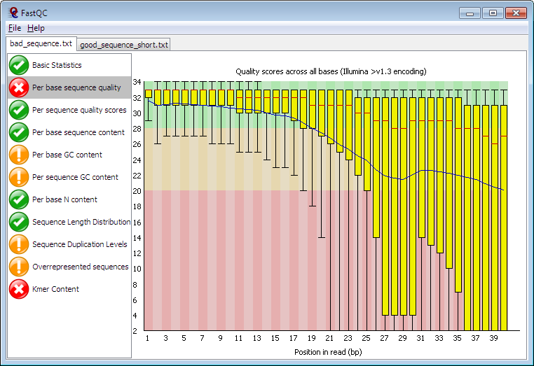

<h1>
<picture>
  <source media="(prefers-color-scheme: dark)" srcset="uk/ac/babraham/FastQC/Resources/fastqc_logo_darkbg.svg">
  <source media="(prefers-color-scheme: light)" srcset="uk/ac/babraham/FastQC/Resources/fastqc_logo.svg">
  
</picture>
</h1>

**A Quality Control application for FastQ files**

FastQC is a program designed to spot potential problems in high througput sequencing datasets.  It runs a set of analyses on one or more raw sequence files in fastq or bam format and produces a report which summarises the results.

FastQC will highlight any areas where this library looks unusual and where you should take a closer look. The program is not tied to any specific type of sequencing technique and can be used to look at libraries coming from a large number of different experiment types (Genomic Sequencing, ChIP-Seq, RNA-Seq, BS-Seq etc etc).

> [!NOTE]
> This GitHub  project page contains the source code for the application and is only really useful only to people wanting to develop new functionality or trace bugs in FastQC.
> If you just want to run the program then you want to go to the [**project web page**](http://www.bioinformatics.babraham.ac.uk/projects/fastqc/) where you can download the compiled pacakges for Windows, OSX and Linux.

## Introduction

Most high throughput sequencers generate output in FastQ format.  This format combines the base calls for the sequence which was generated with an encoded quality value for each base which says how confident the sequencer was that the base call generated was correct.

Before proceeding with the analysis of a sequence data set it is a good idea to do some basic quality control checks on the raw data to ensure that there are no hidden problems which might be more difficult to detect at a later stage.

FastQC is an application which takes a FastQ file and runs a series of tests on it to generate a comprehensive QC report.  This will tell you if there is anything unusual about your sequence.  Each test is flagged as a pass, warning or fail depending on how far it departs from what you'd expect from a normal large dataset with no significant biases.  It's important to stress that warnings or even failures do not necessarily mean that there is a problem with your data, only that it is unusual.  It is possible that the biological nature of your sample means that you would expect this particular bias in your results.

FastQC can be run either as an interactive graphical application which allows you to view results for multiple files in a single application.  Alternatively you can run the program in a non interactive way (say as part of a pipeline) which will generate an HTML report for each file you process.

FastQC is a cross-platform application, written in java. In theory it should run on any platform which has a suitable java runtime environment.
Having said that we've only tested in on Windows, MacOSX and Linux running the Oracle v1.6 to 1.8 JREs.  Please let us know what happened if you try running it on other platforms / JREs.
Please see the detailed instructions [in `INSTALL.md`](`INSTALL.md`) to tell you how to get a suitable java version to run FastQC on your system.

## Installation

Please see the [**project web page**](http://www.bioinformatics.babraham.ac.uk/projects/fastqc/) and the [installation instructions](INSTALL.md) in this repository.

## Contributions

If you have any comments about FastQC we would like to hear them.
You can either create a [GitHub issue](https://github.com/s-andrews/FastQC/issues/) or send them directly to simon.andrews@babraham.ac.uk.

FastQC was written by Simon Andrews, at the Babraham Institute, Cambridge, UK.

https://www.bioinformatics.babraham.ac.uk/

<picture>
  <source media="(prefers-color-scheme: dark)" srcset="uk/ac/babraham/FastQC/Resources/babraham_darkbg.svg">
  <source media="(prefers-color-scheme: light)" srcset="uk/ac/babraham/FastQC/Resources/babraham.svg">
  
</picture>
